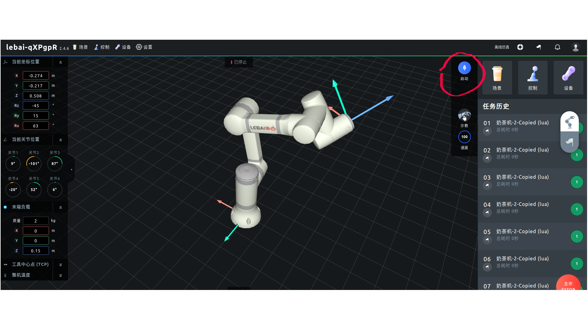

# Documentaion

Please refer document here:

https://lebai-robotics.github.io/lebai-ros-sdk/Noetic.html#


**[DEPRECATED]**

**The following parts are deprecated. Please see the document in the foresaid link.** 


# **This document describe `lebai-ros-sdk` on `ROS Noetic`(Ubuntu 20.04)**

If you use `ROS melodic`, please refer [melodic-dev](https://github.com/lebai-robotics/lebai-ros-sdk/tree/melodic-dev) branch.

If you use `ROS2 galactic`, please refer [galactic-dev](https://github.com/lebai-robotics/lebai-ros-sdk/tree/galactic-dev) branch.

# Prerequsite

As a ROS package, you need firstly install `ROS` .

1. Install `ROS` follow official guide(ros-noetic-desktop-full is sugguested).
   ```
   sudo apt install -y ros-noetic-urdf ros-noetic-tf ros-noetic-xacro ros-noetic-robot-state-publisher ros-noetic-control-msgs rviz ros-noetic-rviz ros-noetic-fcl ros-noetic-industrial-core
   ```

   **Note of `ROS INDUSTRIAL`** : `lebai-ros-sdk` depends on `ROS Industrial`, at the time when we first build this package, `ROS Industrial` doesn't have debian package (Due to some dependencies are broken) for `ROS Noetic`, so we try to build it from source. Now we are happy that we can install`ROS Industrial` from debian package (just run `sudo apt install -y ros-noetic-industrial-core`). So if you use the source to build `ROS Industrial` before, now you can delete the `ROS Industrial` source code from your local workspace and use a debian package install.
   
2. Now the communication to real robot in `lebai-ros-sdk `  is written in python, based on the [`lebai-python-sdk`](https://github.com/lebai-robotics/lebai-python-sdk), So we need install it, and also some other python packages

   ```
   ### lebai sdk
   pip3 install lebai
   
   ### Other python module
   pip3 install urdf-parser-py
   
   ### If pip3 is not install, install it by apt
   sudo apt install python3-pip
   ```

   


# Get `lebai-ros-sdk`

checkout out package and run `catkin_make`

```bash
cd ~/catkin_ws/src
git clone git@github.com:lebai-robotics/lebai-ros-sdk.git -b noetic-dev
cd ~/catkin_ws
catkin_make
```

# Unit Test

All the python driver code is in package `lebai_driver`, it contains an unit test.

To run this unit test, you need to have a simulation rc-master running.

**You can use a real robot to run this test, but the test will made the real robot moving, you must guarantee the move do not cause any damage yourself.**

Before you run the test, you need to set the robot ip of the simulation rc-master:

```
roscd lebai_driver/test
### edit the file test_lebai_driver.launch
### modify the robot_ip according  to real scene.
###
### <arg name="robot_ip" value="192.168.1.104" /> ###
###
```

Then, you can run the test

```
cd ~/catkin_ws/
catkin_make run_tests_lebai_driver
```

# How to run

To connect a real `lebai `robot, you must have a `lebai` robot controller running with network access.

If you connect your `ROS` device to the `lebai WIFI`, usually the network gateway(`10.20.17.1`) address is the robot's physical IP address.

Once the driver started to run, you can get access to the robot controller via `ROS` pub\sub and services. See [lebai_driver](lebai_driver/README.md) for elaborated information.

## Run driver without gui display (lm3 as an example)

```
roslaunch lebai_lm3_support robot_interface_lm3.launch robot_ip:=your_robot_ip has_gripper:=0
```

`robot_ip` is the robot's physical IP address.

`has_gripper ` depends on whether gripper is mounted on the end.

## Run driver with gui display (lm3 as an example)

```
roslaunch lebai_lm3_support robot_interface_lm3_with_visual.launch robot_ip:=your_robot_ip has_gripper:=0
```

`robot_ip` is the robot's physical IP address.

`has_gripper ` depends on whether gripper is mounted on the end.


## Connect lm3 with MoveIt

```
roslaunch lebai_lm3_moveit_config real_robot.launch robot_ip:=your_robot_ip
```

`robot_ip` is the robot's physical IP address.

**Note**: 

Now, we can only control `lm3` manipulator from `MoveIt`. Gripper control is not implemented yet(coming soon).

Before using `MoveIt` to move the manipulator, make sure the robot is enabled, there are two methods:

in `ROS`:

```
rosservice call /system_service/enable "{}"
```

in `l-master` web, click the startup(启动) as show in  the following fig:



# TODO

- `INSTALL` part of `CMakeLists.txt` file is not done.
- gripper control is not implemented.


